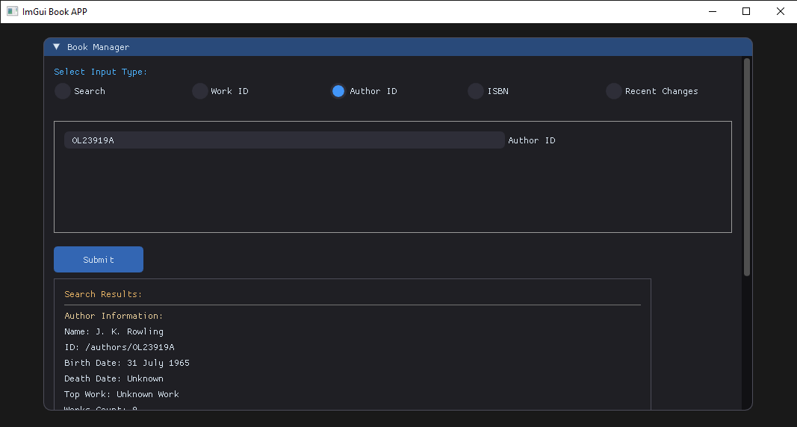

# 📚 Modern Book Manager

<p align="center">
  
</p>

## 📖 Overview
A modern, multi-threaded C++ application that fetches book data from the [Open Library API](https://openlibrary.org/developers/api), processes it, and dynamically updates a sleek graphical user interface (GUI). Designed for efficiency and responsiveness, this app ensures smooth real-time data retrieval, parsing, and display.

---

## 🏗 System Architecture

The application follows a structured multi-threaded approach:

### 1. Download Thread (Data Retrieval)
**Purpose:** Fetches JSON data asynchronously from the Open Library API.

#### 🔄 How It Works:
- Waits for a download request.
- Extracts the host and path from the URL.
- Sends an HTTP GET request using `httplib::Client`.
- Processes the response:
  - ✅ **If successful (200 OK)** → Stores raw JSON data.
  - ❌ **If failed** → Logs an error message.
- Signals the parsing thread that new data is available.

<p align="center">
  
</p>

### 2. Parse Thread (JSON Processing)
**Purpose:** Extracts meaningful information from JSON responses and structures them for UI presentation.

#### 🔄 How It Works:
- Waits for the `data_ready` signal from the download thread.
- Validates the downloaded data.
- Uses `nlohmann::json` to parse JSON.
- Extracts relevant details based on `query_type` (e.g., books, authors, recent changes).
- Handles missing/optional fields gracefully.
- Stores structured data in shared memory (`CommonObjects`).
- Notifies the UI thread that new data is available.

---

### 3. UI Thread (Modern GUI Rendering)
**Purpose:** Updates and manages the interactive graphical user interface (GUI).

#### 🔄 How It Works:
- Waits for the `json_ready` signal from the parse thread.
- Dynamically updates UI components with the latest parsed data.
- Implements interactive features such as:
  - **Search input**
  - **Result navigation**
  - **Data visualization**
- Allows users to initiate new searches, triggering another download cycle.

<p align="center">
  
</p>

---

## 🚀 Execution Flow (Main Loop)
1. Initializes shared data structures (`CommonObjects`).
2. Spawns and manages worker threads (`DownloadThread`, `ParseThread`, `DrawThread`).
3. Waits for user input and signals appropriate threads.
4. Handles application shutdown gracefully, ensuring safe thread termination.

---

## 🎨 Modern UI Design

This application features a sleek **Dear ImGui** interface, styled with a variety of elements, including:

- **Smooth Rounded Corners** → `WindowRounding`, `FrameRounding`
- **Dark Backgrounds & Highlights** → `ImGuiCol_WindowBg`, `ImGuiCol_ButtonHovered`, `ImGuiCol_ButtonActive`
- **Consistent Spacing & Padding** → `ItemSpacing`, `FramePadding`
- **Custom Loading Animations** → Circular progress indicators using `ImDrawList`
- **Error Alerts** → Themed warning boxes for clear debugging feedback

👉 the main UI styling is applied through `ApplyModernTheme` and `ApplyModernTheme1` inside `DrawAppWindow`.

---

## 🛠 Core Technologies

- **C++17/20** → Efficient multi-threading & modern programming paradigms
- **Open Library API** → Reliable book database for fetching book & author details
- **httplib** → Lightweight, dependency-free HTTP client
- **nlohmann::json** → Easy-to-use JSON parser
- **Dear ImGui** → Fast & modern GUI framework
- **std::thread, std::mutex, std::condition_variable** → Robust multi-threading

---

## 📦 Dependencies

- **C++17 or later** – Required for modern C++ features.  
- **httplib** – Lightweight HTTP client for making API requests.  
  - `CPPHTTPLIB_OPENSSL_SUPPORT` enabled for HTTPS support.  
- **OpenSSL** – Required for secure HTTPS connections with `httplib`.  
- **nlohmann::json** – Easy-to-use JSON library for parsing API responses.  
- **Dear ImGui** – Fast and modern GUI framework for rendering the interface.  
- **DirectX 11** – Used for rendering the UI on Windows (`imgui_impl_dx11.h`).  
- **Win32 API** – Required for window management (`imgui_impl_win32.h`).  
- **Multi-threading Support** – Uses `std::thread`, `std::mutex`, and `std::condition_variable`.  

---

## 📚 How to Build & Run

### 🏗 Build & Run Instructions

#### 🔄 Cloning the Repository

- Open a terminal or command prompt.
- Run the following command to clone the repository:
   
   ```sh
   git clone https://github.com/saeed-asle/bookApp.git
   ```
- Navigate into the project directory:
   
   ```sh
   cd bookApp
   ```

### 🔹 Using Visual Studio (Recommended)

- Open **CppApp.sln** in **Visual Studio**.
- Select the desired **build configuration**:
   - **Debug** (for development with debugging features).
   - **Release** (for optimized performance).
- Click **Build** → **Build Solution (Ctrl + Shift + B)**.
- Run the application:
   - Press **F5** to start debugging.
   - Select **Debug → Start Debugging**.

### ⚙️ Setting ConnectedApp as the Main Project

To ensure the project runs correctly, set **ConnectedApp** as the main project.

- **In Visual Studio:**
  - Open your solution in Visual Studio.
  - Locate **Solution Explorer** (`Ctrl + Alt + L` if not visible).
  - Right-click on **ConnectedApp**.
  - Select **"Set as Startup Project"**.
  - The project name should now appear **bold**, indicating it is set as the main project.

- **Using CMake:**
  - Ensure **ConnectedApp** is the default target in `CMakeLists.txt`:
    
    ```cmake
    add_executable(ConnectedApp main.cpp)
    set_target_properties(ConnectedApp PROPERTIES OUTPUT_NAME "ConnectedApp")
    ```

### 🔹 Using CMake (Alternative)

- **Prerequisites:**
  - Ensure you have **CMake**, **Make (Linux/macOS)**, and a **compiler (GCC/Clang/MSVC)** installed.

- **Build & Run:**
   
    ```sh
    mkdir build && cd build
    cmake ..
    make  # Use "cmake --build ." on Windows
    ./ConnectedApp
    ```
---

## ⚡ Author
### &nbsp;&nbsp;&nbsp;**Saeed Asle**  
> ### &nbsp;&nbsp;&nbsp;*[🔗 LinkedIn](https://www.linkedin.com/in/saidasla/)*

---

## 📜 License

MIT License - Feel free to use and modify!

---


<p align="center">
  
</p>

---


