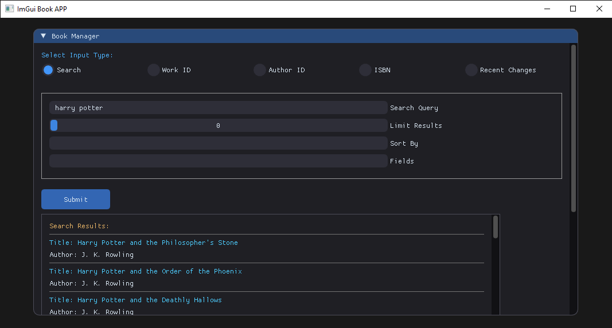
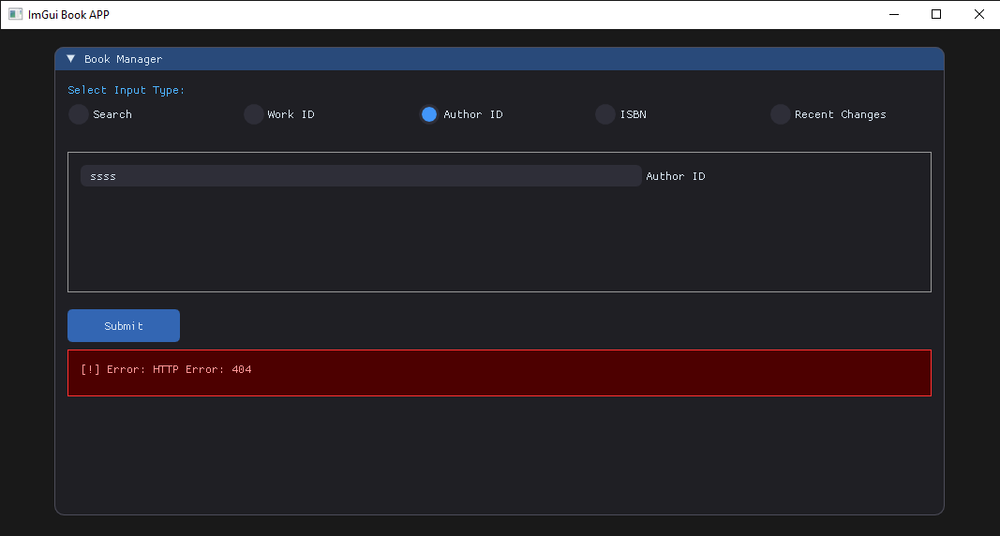
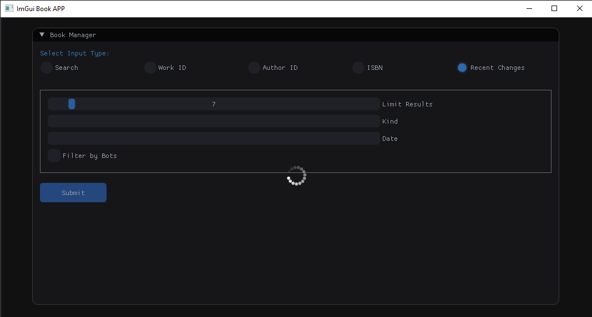

<!DOCTYPE html>
<html lang="en">
<head>
  <meta charset="UTF-8">
  <meta name="viewport" content="width=device-width, initial-scale=1.0">
</head>
<body>
  <h1>📚 Modern Book Manager</h1>
  
  

    
  

  
  

  
  <h2>📖 Overview</h2>
  
A modern, multi-threaded C++ application that fetches book data from the <a href="https://openlibrary.org/developers/api">Open Library API</a>, processes it, and dynamically updates a sleek graphical user interface (GUI). Designed for efficiency and responsiveness, this app ensures smooth real-time data retrieval, parsing, and display.

  
  

  
  <h2>🏗 System Architecture</h2>
  
  
The application follows a structured multi-threaded approach:

  
  <h3>1. Download Thread (Data Retrieval)</h3>
  
<strong>Purpose:</strong> Fetches JSON data asynchronously from the Open Library API.

  
  
<strong>🔄 How It Works:</strong>

  <ul>
    <li>Waits for a download request.</li>
    <li>Extracts the host and path from the URL.</li>
    <li>Sends an HTTP GET request using <code>httplib::Client</code>.</li>
    <li>Processes the response:
      <ul>
        <li><strong>If successful (200 OK)</strong> → Stores raw JSON data.</li>
        <li><strong>If failed</strong> → Logs an error message.</li>
      </ul>
    </li>
    <li>Signals the parsing thread that new data is available.</li>
  </ul>
  
  

    
  

  
  <h3>2. Parse Thread (JSON Processing)</h3>
  
<strong>Purpose:</strong> Extracts meaningful information from JSON responses and structures them for UI presentation.

  
  
<strong>🔄 How It Works:</strong>

  <ul>
    <li>Waits for the <code>data_ready</code> signal from the download thread.</li>
    <li>Validates the downloaded data.</li>
    <li>Uses <code>nlohmann::json</code> to parse JSON.</li>
    <li>Extracts relevant details based on <code>query_type</code> (e.g., books, authors, recent changes).</li>
    <li>Handles missing/optional fields gracefully.</li>
    <li>Stores structured data in shared memory (<code>CommonObjects</code>).</li>
    <li>Notifies the UI thread that new data is available.</li>
  </ul>
  
  <h3>3. UI Thread (Modern GUI Rendering)</h3>
  
<strong>Purpose:</strong> Updates and manages the interactive graphical user interface (GUI).

  
  
<strong>🔄 How It Works:</strong>

  <ul>
    <li>Waits for the <code>json_ready</code> signal from the parse thread.</li>
    <li>Dynamically updates UI components with the latest parsed data.</li>
    <li>Implements interactive features such as:
      <ul>
        <li><strong>Search input</strong></li>
        <li><strong>Result navigation</strong></li>
        <li><strong>Data visualization</strong></li>
      </ul>
    </li>
    <li>Allows users to initiate new searches, triggering another download cycle.</li>
  </ul>
  
  

    
  

  
  

  
  <h2>🚀 Execution Flow (Main Loop)</h2>
  <ul>
    <li>Initializes shared data structures (<code>CommonObjects</code>).</li>
    <li>Spawns and manages worker threads (<code>DownloadThread</code>, <code>ParseThread</code>, <code>DrawThread</code>).</li>
    <li>Waits for user input and signals appropriate threads.</li>
    <li>Handles application shutdown gracefully, ensuring safe thread termination.</li>
  </ul>
    

    <h1>🎨 Modern UI Design</h1>

  
This application features a sleek <strong>Dear ImGui</strong> interface, styled with a variety of elements, including:

  
  <ul>
    <li><strong>Smooth Rounded Corners</strong> → <code>WindowRounding</code>, <code>FrameRounding</code></li>
    <li><strong>Dark Backgrounds & Highlights</strong> → <code>ImGuiCol_WindowBg</code>, <code>ImGuiCol_ButtonHovered</code>, <code>ImGuiCol_ButtonActive</code></li>
    <li><strong>Consistent Spacing & Padding</strong> → <code>ItemSpacing</code>, <code>FramePadding</code></li>
    <li><strong>Custom Loading Animations</strong> → Circular progress indicators using <code>ImDrawList</code></li>
    <li><strong>Error Alerts</strong> → Themed warning boxes for clear debugging feedback</li>
  </ul>
  
  
👉 The main UI styling is applied through <code>ApplyModernTheme</code> and <code>ApplyModernTheme1</code> inside <code>DrawAppWindow</code>.

  

  <h2>🛠 Core Technologies</h2>
  <ul>
    <li><strong>C++17/20</strong> → Efficient multi-threading & modern programming paradigms</li>
    <li><strong>Open Library API</strong> → Reliable book database for fetching book & author details</li>
    <li><strong>httplib</strong> → Lightweight, dependency-free HTTP client</li>
    <li><strong>nlohmann::json</strong> → Easy-to-use JSON parser</li>
    <li><strong>Dear ImGui</strong> → Fast & modern GUI framework</li>
    <li><strong>std::thread, std::mutex, std::condition_variable</strong> → Robust multi-threading</li>
  </ul>

  

  <h2>📦 Dependencies</h2>
  <ul>
    <li><strong>C++17 or later</strong> – Required for modern C++ features.</li>
    <li><strong>httplib</strong> – Lightweight HTTP client for making API requests.
      <ul>
        <li><code>CPPHTTPLIB_OPENSSL_SUPPORT</code> enabled for HTTPS support.</li>
      </ul>
    </li>
    <li><strong>OpenSSL</strong> – Required for secure HTTPS connections with <code>httplib</code>.</li>
    <li><strong>nlohmann::json</strong> – Easy-to-use JSON library for parsing API responses.</li>
    <li><strong>Dear ImGui</strong> – Fast and modern GUI framework for rendering the interface.</li>
    <li><strong>DirectX 11</strong> – Used for rendering the UI on Windows (<code>imgui_impl_dx11.h</code>).</li>
    <li><strong>Win32 API</strong> – Required for window management (<code>imgui_impl_win32.h</code>).</li>
    <li><strong>Multi-threading Support</strong> – Uses <code>std::thread</code>, <code>std::mutex</code>, and <code>std::condition_variable</code>.</li>
  </ul>

  

<h2>📚 How to Build & Run</h2>

<h3>1. Clone the Repository</h3>

To get started, clone the repository and navigate into the project directory:

<pre><code>git clone https://github.com/saeed-asle/bookApp.git
cd bookApp</code></pre>

<h3>2. Using Visual Studio (Recommended)</h3>

<ul>
  <li><strong>
Opening the Project
</strong>
    <ul>
      <li>Open <strong>CppApp.sln</strong> in <strong>Visual Studio</strong>.</li>
      <li>Locate <strong>Solution Explorer</strong> (<code>Ctrl + Alt + L</code> if not visible).</li>
    </ul>
  </li>

  <li><strong>
Set <code>ConnectedApp</code> as the Main Project
</strong>
    <ul>
      <li>To ensure the correct project runs:</li>
      <ul>
        <li>Right-click on <strong>ConnectedApp</strong> in Solution Explorer.</li>
        <li>Select <strong>"Set as Startup Project"</strong> (it should appear <strong>bold</strong> once set).</li>
      </ul>
    </ul>
  </li>

  <li><strong>
Build and Run
</strong>
    <ul>
      <li>Choose a <strong>build configuration</strong>:
        <ul>
          <li><strong>Debug</strong> (for development with debugging features).</li>
          <li><strong>Release</strong> (for optimized performance).</li>
        </ul>
      </li>
      <li>Click <strong>Build → Build Solution (Ctrl + Shift + B)</strong>.</li>
      <li>Run the application:
        <ul>
          <li>Press <strong>F5</strong> to start debugging.</li>
          <li>Or select <strong>Debug → Start Debugging</strong>.</li>
        </ul>
      </li>
    </ul>
  </li>
</ul>

<h3>3. Using CMake (Alternative)</h3>

If you prefer CMake instead of Visual Studio, follow these steps:

<ul>
  <li><strong>
Prerequisites
</strong>
    <ul>
      <li>Install <strong>CMake</strong>: <a href="https://cmake.org/download/">Download CMake</a></li>
      <li>Install a <strong>C++ Compiler</strong>:
        <ul>
          <li><strong>Windows</strong>: Install <strong>MSVC</strong> (comes with Visual Studio) or <strong>MinGW-w64</strong>.</li>
          <li><strong>Linux</strong>: Install <strong>GCC</strong> (<code>sudo apt install build-essential</code>).</li>
          <li><strong>macOS</strong>: Install <strong>Clang</strong> (<code>xcode-select --install</code>).</li>
        </ul>
      </li>
      <li><strong>(Windows users only)</strong> Install <strong>Ninja</strong> or use <code>cmake --build .</code> instead of <code>make</code>.</li>
    </ul>
  </li>

  <li><strong>
Build & Run
</strong>
      <ul>
   <li> 
Run the following commands inside the project folder:
</li>
         </ul>
      <ul>
    <pre><code>mkdir build && cd build
cmake ..
cmake --build .
./ConnectedApp  # Run the executable (Use "ConnectedApp.exe" on Windows)</code></pre>
          </ul>

  </li>

<li><strong>Ensure <code>ConnectedApp</code> is the Default Target</strong>
  <ul>
    <li>
Check that <code>CMakeLists.txt</code> sets <code>ConnectedApp</code> as the executable:
</li>
  </ul>
<ul>
        <pre><code>add_executable(ConnectedApp main.cpp)
set_target_properties(ConnectedApp PROPERTIES OUTPUT_NAME "ConnectedApp")</code></pre>
</ul>

</li>
</ul>

<h2 >⚡ Author</h2>

  
   
      <a href="https://www.linkedin.com/in/saidasla/" target="_blank" style="color: #0077b5; text-decoration: none; font-weight: bold;">
      🔗 LinkedIn
    </a>

  <h2>📜 License</h2>
  
MIT License - Feel free to use and modify!

  

  

    
  

</body>
</html>
